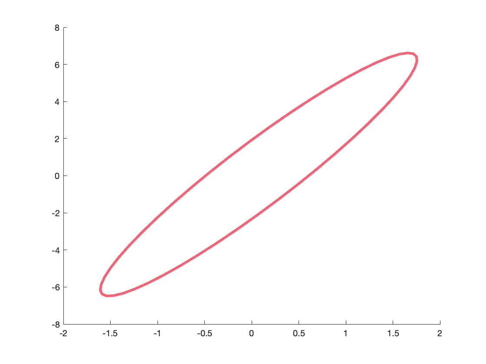

# plot_gaussian_ellipsoid.m
This MATLAB function plots the Gaussian line/ellipse/ellipsoid represented by $X$ and $S$, where $X$ is the mean vector and $S$ is the covariance matrix. 

$$
\begin{gather}
    X \in \mathbb{R}^{d\times 1} \\
    S \in \mathbb{R}^{d\times D} 
\end{gather}
$$

Please direct any questions to blhanson@ucsd.edu.

